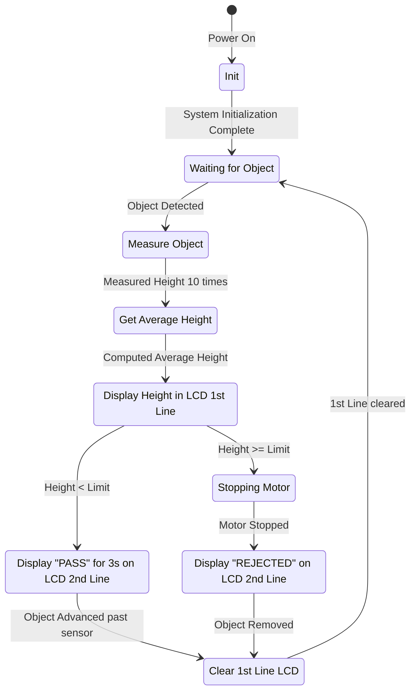

# 📦 Controllable-Speed Conveyor Belt with Height Detection

Welcome to the Controllable-Speed Conveyor Belt project! This project leverages the STM32F103C8T6 Bluepill microcontroller and the libopencm3 library to create a sophisticated conveyor belt system. The system is designed to detect the height of items passing through it and stop the conveyor belt whenever an item is too large. Additionally, it uses a PID controller to adapt to different weights and perturbations, ensuring smooth and efficient operation. The project is built using PlatformIO.

## 🚀 Features

- **Controllable Speed**: Adjust the speed of the conveyor belt using a potentiometer.
- **Height Detection**: Measure the height of items using the HC-SR04 ultrasonic sensor.
- **Automatic Stopping**: Stop the conveyor belt if an item is too large.
- **LCD Display**: Display the measured height and status messages on a 16x2 LCD.
- **PID Controller**: Adapt to different weights and perturbations for smooth operation.

## 🛠️ Hardware

- **Microcontroller**: STM32F103C8T6 Bluepill
  - **PWM Control**: For motor speed control.
  - **ADC**: For reading potentiometer values.
  - **GPIO**: For interfacing with the HC-SR04 ultrasonic sensor and LCD.
  - **Timers**: For precise timing and control operations.
  - **I2C**: For communication with the LCD.

- **Ultrasonic Sensor**: HC-SR04
- **LCD**: 16x2 LCD with I2C expander PCF8574
- **Motor Driver**: PWM control for motor speed
- **Potentiometer**: For adjusting the speed setpoint

## 📈 State Machine Diagram



## 📚 Code Overview

This project is structured to ensure modularity and ease of understanding. The main components include the ultrasonic sensor for height detection, a PID controller for speed regulation, a motor driver for controlling the conveyor belt, and an LCD for displaying information.

### Key Files

- `src/main.c`: Main application code that initializes the system and runs the main loop.
- `include/hc_sr04.h`: Ultrasonic sensor driver that initializes the sensor and retrieves distance measurements.
- `include/pid.h`: PID controller implementation that adjusts the motor speed based on the setpoint and measured values.
- `include/motor_driver.h`: Motor driver functions that control the motor speed using PWM.
- `include/lcd.h`: LCD driver functions that initialize and control the 16x2 LCD.
- `include/speedometer.h`: Speed measurement functions that calculate the speed in RPM and rad/s implemented with DMA.
- `include/setpoint.h`: Potentiometer module for ADC implemented with DMA.

## 🛠️ Setup and Installation

1. **Clone the repository**:
    ```sh
    git clone https://github.com/ICOMP-UNC/Team-3.git
    cd Team-3
    ```

2. **Install PlatformIO**:
    ```sh
    pip install platformio
    ```

3. **Build and upload the firmware**:
    ```sh
    pio run --target upload
    ```

## 🔎 About Us

### **Alfonso Mouton**: Head Developer


### **Nicolais Seia**: Developer and Documentation Specialist


### **Ignacio Ledesma**: Developer and QA

## 🧩 Useful Resources

- [libopencm3 API](https://libopencm3.org/docs/latest/html/)
- [STM32F103 Bluepill Datasheet](https://www.st.com/resource/en/datasheet/stm32f103c8.pdf)
- [STM32F103 Bluepill ERC Handbook](https://erc-bpgc.github.io/handbook/electronics/Development_Boards/STM32/)

## 📜 License

This project is licensed under the MIT License. See the [LICENSE](LICENSE) file for details.

## 🤝 Contributing

Contributions are welcome! Please open an issue or submit a pull request.
