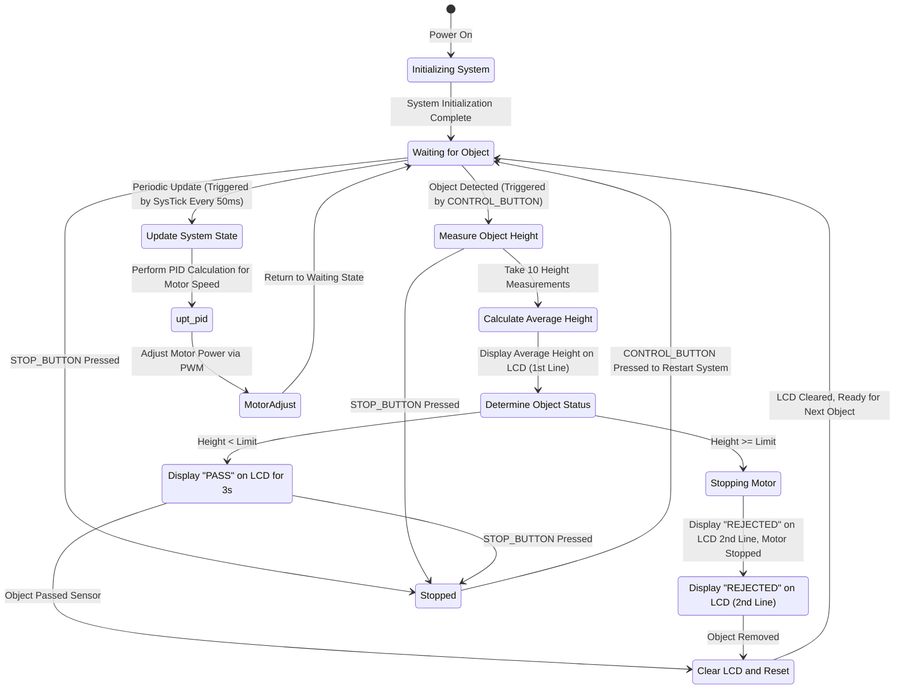

# 📦 Controllable-Speed Conveyor Belt with Height Detection

Welcome to the Controllable-Speed Conveyor Belt project! This project leverages the STM32F103C8T6 Bluepill microcontroller and the libopencm3 library to create an advanced conveyor belt system with adjustable speed and height-based object detection. The system stops the conveyor if an object exceeds a defined height limit and uses a PID controller to adjust the belt's speed smoothly, accommodating different weights and perturbations. This project is built using PlatformIO.

## 📽️ Video Preview

## 🚀 Features

- **Controllable Speed**: Adjust the conveyor belt speed using a potentiometer.
- **Height Detection**: Measure object height using the HC-SR04 ultrasonic sensor, with height averaging and filtering.
- **Automatic Stopping**: Automatically stop the conveyor if an object exceeds the height limit.
- **LCD Display**: Display the measured height, status messages, and setpoint on a 16x2 LCD.
- **PID Controller**: Provides smooth motor control by adapting to weight and disturbance changes in real-time.
- **Input Management**: Start/stop button managed with EXTI-based interrupts and debounce handling for reliable control. Also a Switch is implemented to detect objects passing through.
- **System Updates**: Periodic system updates handle PID adjustments, height measurement, display refresh, and motor state management.

## 🛠️ Hardware

- **Microcontroller**: STM32F103C8T6 Bluepill
  - **PWM Control**: Motor speed control using PWM signals.
  - **ADC**: Potentiometer input for speed setpoint adjustment.
  - **GPIO**: Ultrasonic sensor and button interfacing.
  - **Timers**: Utilized for PWM generation, timing, and EXTI-based interrupts.
  - **I2C**: LCD communication through the PCF8574 I2C expander.

- **Ultrasonic Sensor**: HC-SR04 for height detection.
- **LCD**: 16x2 LCD with PCF8574 I2C expander for easy I2C communication.
- **Motor Driver**: PWM-based motor control.
- **Potentiometer**: Speed adjustment setpoint input.
- **Switches**: Start/stop button managed with EXTI-based interrupts and debounce handling for reliable control. Also a Switch is implemented to detect objects passing through.

## 📈 State Machine Diagram

## 📚 Code Overview

This project is structured modularly to ensure clean and manageable code. Key components include the ultrasonic sensor, PID controller, motor driver, buttons for control, an LCD for user feedback, and system update functions to manage timed events. Each module handles a distinct aspect of the conveyor system.

### Doxygen Documentation

For detailed and more readable documentation, open the `docs/html/index.html` file in a web browser by double-clicking it

### Key Files

- `src/main.c`: Main application code that initializes the system, handles the state machine, and manages the main loop.
- `include/hc_sr04.h`: Ultrasonic sensor driver that initializes the sensor, triggers measurements, and retrieves distance readings with edge detection using timers.
- `include/pid.h`: PID controller implementation, maintaining a setpoint, and calculating motor power based on error, integral, and derivative components.
- `include/motor_driver.h`: Motor control functions for speed adjustment using PWM.
- `include/lcd.h`: LCD driver functions, initializing and controlling a 16x2 LCD via I2C with the PCF8574 expander.
- `include/speedometer.h`: Measures conveyor speed in RPM and rad/s, implemented using a timer with DMA for efficient data transfer.
- `include/setpoint.h`: Potentiometer module for reading speed setpoints using ADC with DMA.
- `include/button.h`: Handles EXTI-based button and switch interrupts with debouncing logic.
- `include/utils.h`: Utility functions, including a floating-point to string converter for display purposes.
- `include/update.h`: **System update management functions** that provide periodic control for:
  - **PID adjustments**: Ensures that motor power is continually adapted based on the PID feedback loop.
  - **Height measurement**: Triggers object height detection and averages measurements to determine if the object meets the threshold.
  - **Display management**: Refreshes LCD display with real-time information on speed and object detection status.
  - **Motor state management**: Controls motor state based on conditions such as detected object size and button inputs.

## 🛠️ Setup and Installation

More information inside the [INSTALL](INSTALL.md) file

## 🔎 Team Members

### **Alfonso Mouton**:
- **Head Developer**: leads project design and system architecture.
- I like to get cheap things and fix them.
- I'm currently working on IOT stuff.
- Also i'm a photographer.

### **Nicolais Seia**:
- **Developer and Documentation Specialist**: I helped develop the code for this project and my main role was to document the code and the develop process from start to finish.
- I am 23 years old, I am finishing the 4th year of my degree.
- I like to learn more about programming, I am in constant search of new learning, such as security and ethical hacking.
- I like videogames a lot and I enjoy that in my free time.

### **Ignacio Ledesma**:
- **Developer and QA Specialist**: in this project, my main focus was to manage quality assurance, ensuring all components function optimally and organizing the project in various aspects. Also, I helped optimizing our program.
- I am 22 years old. Currently in my fourth year of university, with a passion for learning.
- Known for adaptability and a focus on solving complex problems.
- Driven by continuous learning and a commitment to personal and professional growth.

## 🧩 Useful Resources

- [libopencm3 API](https://libopencm3.org/docs/latest/html/): Documentation for the libopencm3 library used in this project.
- [STM32F103 Bluepill Datasheet](https://www.st.com/resource/en/datasheet/stm32f103c8.pdf): Technical datasheet for the STM32F103 microcontroller.
- [STM32F103 Bluepill Manual](http://www.st.com/internet/com/TECHNICAL_RESOURCES/TECHNICAL_LITERATURE/REFERENCE_MANUAL/CD00171190.pdf): Reference manual for STM32F103 series.
- [STM32F103 Bluepill ERC Handbook](https://erc-bpgc.github.io/handbook/electronics/Development_Boards/STM32/): Community resource for STM32 development.

## 📜 License

This project is licensed under the MIT License. See the [LICENSE](LICENSE) file for details.

## 🤝 Contributing

Contributions are welcome! Please open an issue or submit a pull request if you have suggestions or improvements.
